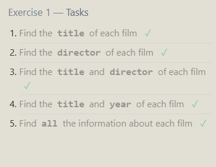

Exercise 1:

Find the title of each film ✓

```sql
SELECT title
FROM movies;
```

Find the director of each film ✓

```sql
SELECT director
FROM movies;
```

Find the title and director of each film ✓

```sql
SELECT title, director
FROM movies;
```

Find the title and year of each film ✓

```sql
SELECT title,Year
FROM movies;
```

Find all the information about each film

```sql
SELECT *
FROM movies;
```



Exercise 2:

Find the movie with a row id of 6

```sql
SELECT *
FROM movies
where id = 6;
```

Find the movies released in the years between 2000 and 2010

```sql
SELECT *
FROM movies
where year between 2000 and 2010;
```

Find the movies not released in the years between 2000 and 2010

```sql
SELECT *
FROM movies
where year not between 2000 and 2010;
```

Find the first 5 Pixar movies and their release year

```sql
SELECT *
FROM movies
Where year between 1995 and 2003;
```


Exercise 3

Find all the Toy Story movies ✓

```sql
SELECT *
FROM movies
where title like "Toy Story%";
```

Find all the movies directed by John Lasseter ✓

```sql
SELECT *
FROM movies
where director = "John Lasseter"
```

Find all the movies (and director) not directed by John Lasseter

```sql
SELECT *
FROM movies
where director != "John Lasseter"
```

Find all the WALL-\* movies

```sql
SELECT *
FROM movies
where title like "WALL-%"
```


Exercise 4

List all directors of Pixar movies (alphabetically), without duplicates ✓

```sql
SELECT distinct director
FROM movies
Order by Director;
```

List the last four Pixar movies released (ordered from most recent to least)

```sql
 SELECT *
FROM movies
Order by Year Desc
Limit 4
```

List the first five Pixar movies sorted alphabetically

```sql
SELECT *
FROM movies
Order by title
Limit 5
```

List the next five Pixar movies sorted alphabetically

```sql
SELECT *
FROM movies
Order by title
Limit 5 Offset 5
```


Exercise 5

List all the Canadian cities and their populations ✓

```sql
SELECT *
FROM north_american_cities
where country = "Canada";
```

Order all the cities in the United States by their latitude from north to south

```sql
SELECT * FROM north_american_cities
where country = "United States"
Order by latitude desc;
```

List all the cities west of Chicago, ordered from west to east

```sql
SELECT * FROM north_american_cities
where longitude < -87.629798
Order by longitude;
```

List the two largest cities in Mexico (by population)

```sql
SELECT *
FROM north_american_cities
where country = "Mexico"
Order by population desc
Limit 2
```

List the third and fourth largest cities (by population) in the United States and their populations

```sql
SELECT * FROM north_american_cities
where country = "United States"
Order by population desc
Limit 2 Offset 2
```


